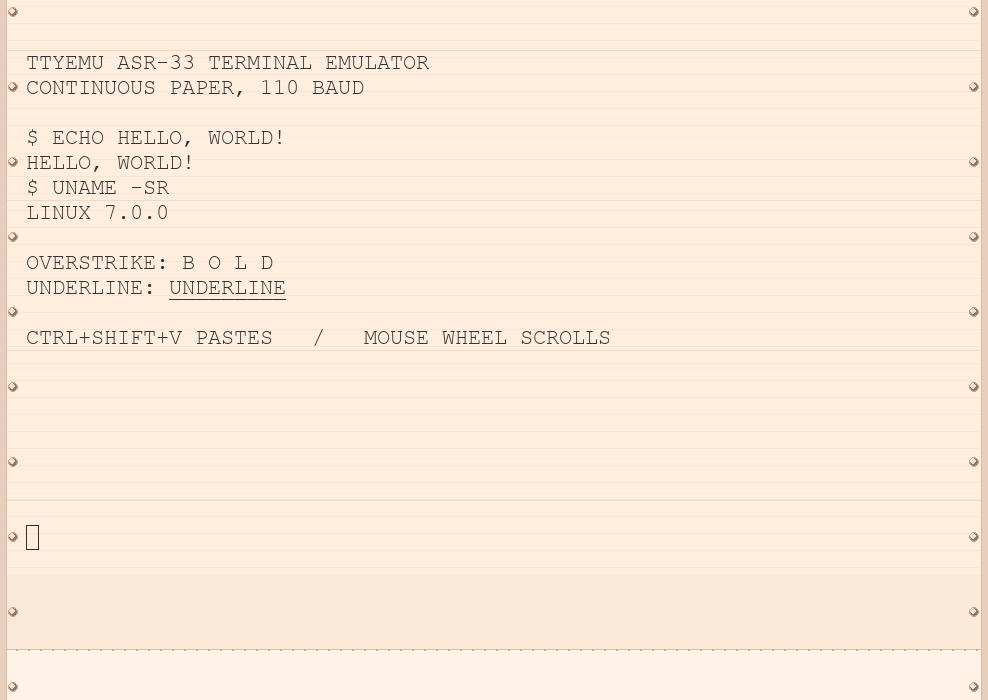

Terminal emulator for ASR-33.

ttyemu was originally created by
[Random832](https://github.com/Random832/ttyemu). Hugh Pyle subsequently
maintained [a fork](https://github.com/hughpyle/ttyemu) that added sound,
Telnet support, and other platform and usability improvements. This repository
is based directly on Hugh Pyle's fork and retains work from both predecessors.

Changes made in this fork include current-Python compatibility through
telnetlib3, improved Pygame rendering and continuous-paper simulation,
clipboard paste and mouse-wheel scrolling, and a PyInstaller recipe for
building a standalone Linux executable.

Features:

- Pygame and Tkinter frontends.

- Backends for pty (Linux/Mac) and ssh (Paramiko library)

- Limits output to an authentic 10 characters per second. Hit F5 to make it go
  faster (toggle on tkinter frontend, hold on pygame)

- Sound (with the pygame frontend)!  The lid starts closed for quieter
  operation; hit F7 to open or close it.

- Procedurally drawn continuous paper with printable side and top margins,
  subtle fibers, tractor-feed holes, roll edges, and advance shading around
  perforated page divisions. A six-line bottom paper preview keeps an
  approaching page division visible below the active typing line.

- Scrolling (with Page Up and Page Down; the Pygame frontend also supports the
  mouse wheel, and the Tkinter frontend has a scrollbar)

- Output a form feed to clear everything

- Paste clipboard text with Ctrl+Shift+V or Shift+Insert. Pasted input is sent
  at the emulated terminal speed; hold F5 to paste without the added delay.

Standalone Linux executable
---------------------------

Create and activate an isolated virtual environment, install the packages in
``requirements-build.txt``, then run ``pyinstaller ttyemu.spec``. The one-file
console executable is written to ``dist/ttyemu`` and can be launched from any
working directory. It still starts the original Pygame frontend with a local
``sh`` connected through the PTY backend.

Various bugs and to-dos:

- No user interface to select between frontends and backends. For now, edit the
  script.

- Speed throttling (whether through the backend or throttle.py) does not work
  well on Linux. It works on WSL and has also been reported to work on macOS.
  You'll still get the 10-chars-per-second output, but
  interrupting long outputs won't work.

- Most of the fun termios functions (echoprt, echok, kill, reprint, discard)
  don't work on WSL

- Add tty-37 support (half lines, reverse line feed, and lowercase). For now,
  the forced uppercase can be disabled by editing the upper() function

- Add backends for wslbridge and msys/cygwin.

- Improve graphics, better font, allow "ink spread" for overstruck bold.

- Simulate classical 'stty lcase' line discipline for input of upper/lowercase
  letters and `` `{|}~`` (part or all of this are broken in modern OSes)

- Discard and regenerate scrollback to limit memory usage. The existing
  AbstractLine class should be useful for this, but nothing is hooked up.
